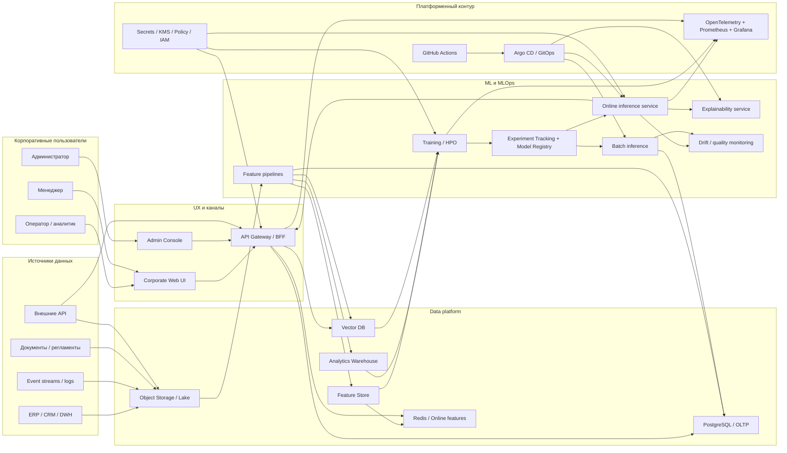
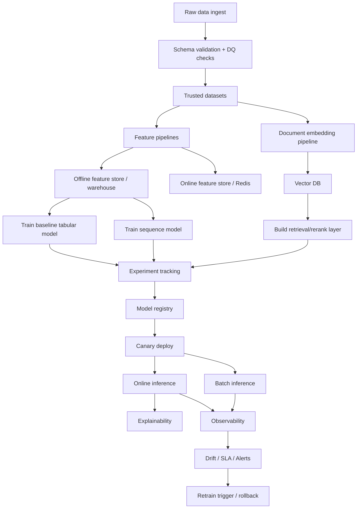
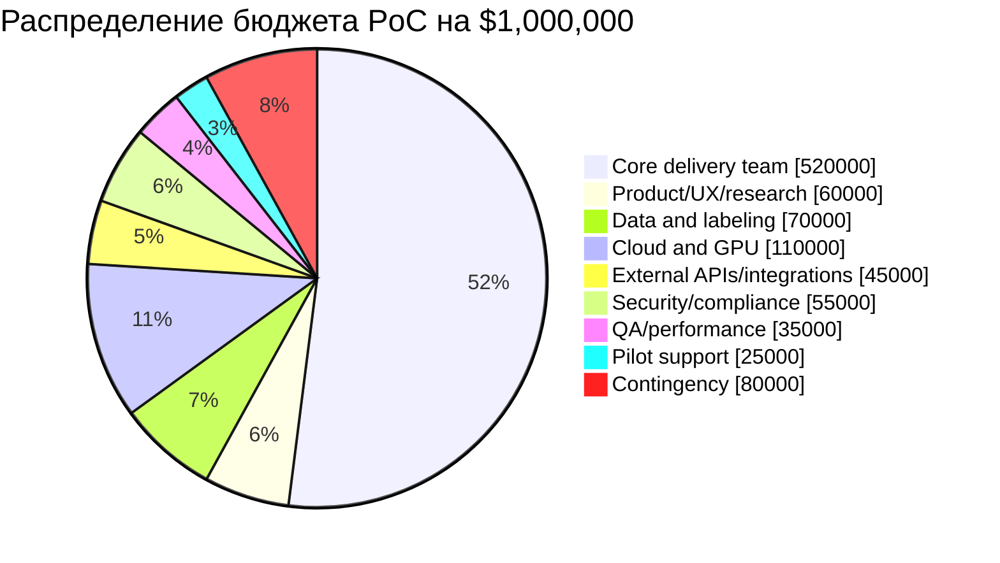

# Аналитический отчёт по разработке корпоративного ML-first PoC для хакатона с целевым бюджетом около $1,000,000

## Executive summary

Если собрать всё в один вывод, то наиболее сильный формат для хакатона с прицелом на корпоративный PoC за бюджет порядка $1 млн — это не “одна умная модель”, а **платформенный AI/ML-прототип уровня enterprise**, который показывает полный цикл: сбор и валидацию данных, feature engineering, обучение нескольких моделей, model registry, explainability, online/offline inference, drift monitoring, CI/CD, security-by-design и управляемый корпоративный интерфейс. Такой формат лучше продаётся заказчику, потому что он показывает не только “магический ML”, но и то, как решение реально доживёт до пилота и эксплуатации. В качестве базовой референсной концепции в этом отчёте используется **Enterprise AI Decisioning Platform** — универсальная платформа, которую можно быстро адаптировать под скоринг, ранжирование, прогнозирование, anomaly detection, рекомендации, workflow triage или AI-assisted copilot для внутренних процессов. Это допущение сделано потому, что предметная область решения в запросе **не указана**. citeturn19search5turn16search8turn19search1

Для greenfield-проекта с сильным упором на MLOps и быстрый выход в демо я бы ставил **GCP как основной кандидат**, **Azure как сильную альтернативу для Microsoft-first организаций**, а **AWS — как вариант для компаний с уже существующим AWS-ландшафтом и опытом platform engineering**. Причина в том, что Vertex AI сегодня выглядит как наиболее цельная unified-платформа для train/deploy/monitor/pipelines/feature workflows, GKE даёт прозрачную модель cluster management fee и SLA, а Azure ML очень силён для корпоративных MLOps-сценариев в экосистеме Microsoft. При этом у AWS есть важный текущий нюанс: AWS прямо указывает, что ряд SageMaker AI features, включая Model Monitor, Clarify, Debugger и другие, **с 30 июля 2026 года перестают быть доступны для новых клиентов**; это не делает AWS плохим выбором, но повышает риск завязки на managed-функции, которые в greenfield PoC лучше не делать критичными. Для EKS AWS указывает $0.10 за cluster-hour на стандартной поддержке Kubernetes и $0.60 за cluster-hour на extended support; GKE указывает flat fee $0.10 за cluster-hour и monthly credit $74.40 на billing account для zonal/Autopilot cluster, а также SLA 99.95% для control plane Autopilot и regional Standard clusters. Azure AKS на публичной pricing page показывает Free tier без SLA и Standard tier с financially backed API server SLA, но сами суммы control-plane pricing зависят от региона и калькулятора. citeturn16search0turn0search3turn14view0turn15view0turn15view1turn19search5turn19search1

Под бюджет около $1 млн не стоит “съедать” деньги чисто инфраструктурой. Для корпоративного PoC деньги почти всегда выигрывает команда, данные, интеграции и hardening. Практически разумная пропорция такая: **около половины бюджета — люди и delivery**, дальше данные и интеграции, затем облако/GPU, безопасность и комплаенс, UX, тестирование и резерв. Это особенно верно для хакатонного сценария, где инфраструктура важна, но главный артефакт — убедительный работающий slice продукта, который можно быстро перевести в пилот. Этот отчёт поэтому предлагает архитектуру, в которой хакатонный MVP — это честно работающий узкий сегмент будущей платформы, а не декоративная “космическая” схема без deploy path. Это согласуется и с входными материалами пользователя: присланные материалы акцентируют практический MVP, explainable-логику, безопасный workflow и demo-mode как важные свойства хакатонного продукта. fileciteturn0file0 fileciteturn0file1 fileciteturn0file2

Итоговая рекомендация такая: **строить enterprise-grade reference architecture, но на хакатоне реализовать только один end-to-end боевой контур** — ingestion → features → train → registry → canary deploy → online inference → explanation → monitoring. Всё сверх этого должно быть либо в roadmap, либо в mock/stub-формате, честно обозначенном на защите.

## Входные данные и допущения

В запросе есть несколько параметров, которые прямо **не указаны**. Для корпоративного проектирования это не проблема, если явно зафиксировать рабочие допущения и не выдавать их за факты.

| Параметр | Статус | Рабочее допущение для архитектуры | Комментарий |
|---|---|---:|---|
| Предметная область | не указано | универсальная decisioning/recommendation/risk платформа | Позволяет переиспользовать стек под разные кейсы |
| Тип данных | не указано | табличные данные + event/log data + документы + внешние API | Самый реалистичный enterprise-микс |
| Объём исторических данных | не указано | 1–5 ТБ raw, 50–200 млн событий, 100k–5 млн сущностей | Достаточно для серьёзного PoC |
| Online SLA | не указано | p95 ≤ 300 мс, p99 ≤ 800 мс | Для корпоративных внутренних B2B-интерфейсов это реалистично |
| Нагрузка | не указано | 50–500 RPS online, batch до 5–20 млн записей/прогон | Типичный диапазон для PoC/пилота |
| География и право | не указано | если есть ПДн граждан РФ — применять 152-ФЗ и отдельно проверять требования 242-ФЗ | Это нужно проверить в discovery |
| Команда | не указано | 10–13 core members + part-time SME/security/legal | Ниже это детализировано |
| Срок после хакатона | не указано | 24 недели до pilot-ready состояния | Для бюджета $1M это разумный горизонт |

Во входных файлах уже просматриваются два полезных сигнала. Первый: пользователь ожидает не “общий обзор”, а **максимально практический пакет для команды**, где важны конкретные сценарии, explainability, архитектура и demoability. Второй: один из присланных материалов описывает реализацию через **Next.js + TypeScript + Supabase + demo mode**, то есть пользователь явно ценит быструю разработку интерфейса и автономный демонстрационный контур без тяжёлой зависимости от внешней инфраструктуры. Для текущего отчёта это означает, что фронтовой корпоративный интерфейс надо проектировать отдельно от основной ML-платформы, а демо-слой — держать как thin enterprise UI поверх API и mockable data sources. fileciteturn0file0 fileciteturn0file1

Если в решении появляются персональные данные, особенно данные граждан РФ, надо уже на этапе архитектуры разделять **production-grade legal path** и **hackathon demo path**. Базовый закон для обработки персональных данных в РФ — 152-ФЗ, а изменения 242-ФЗ затрагивают порядок обработки персональных данных в информационно-телекоммуникационных сетях и практику локализации. Для PoC это означает, что уже на discovery надо решить, используются ли реальные ПДн, псевдонимизированные данные, синтетические данные или sandbox-only datasets. citeturn5search1turn26search2

## Целевая концепция и облачный выбор

Рекомендованный формат решения — **Enterprise AI Decisioning Platform**. По сути это корпоративная платформа, которая умеет принимать смешанные данные из внутренних систем и внешних API, строить признаки, обучать несколько семейств моделей, объяснять предсказания и возвращать рекомендации либо в виде score/rank/risk, либо в виде action recommendation в интерфейсе сотрудника, менеджера или партнёра. Такой каркас хорошо подходит под большинство сильных хакатонных кейсов, потому что демонстрирует измеримую ML-ценность и при этом очень убедительно показывает MLOps-зрелость.

Внутри этой платформы лучше сразу закладывать **двухконтурную логику**. Первый контур — **predictive core**: табличный/событийный ML для скоринга, ранжирования, прогноза и anomaly detection. Второй контур — **reasoning/retrieval layer**: документный и knowledge-based слой для поиска релевантных фактов, протоколов, регламентов, кейсов и explanatory summaries. В итоге жюри и заказчик видят не просто число “0.83”, а объяснимый outcome: почему система рекомендует это решение, какие факторы на него повлияли и какие данные использовались.

### Сравнение облачных вариантов

Ниже — практическое сравнение трёх основных вариантов. Таблица объединяет официальные возможности платформ и модель бюджетирования для **нормализованного корпоративного PoC**; диапазоны monthly run-rate — это **модельная оценка**, а не официальный тарифный quote.

Сводные факты в таблице опираются на официальные страницы AWS, Google Cloud и Microsoft: EKS pricing, GKE pricing, Vertex AI docs, Azure ML и AKS docs, а также AWS compliance/SageMaker notices. citeturn0search3turn14view0turn15view0turn16search0turn16search8turn19search5turn19search1turn24search1turn24search5turn6search5turn7search0turn6search1

| Облако | Сильные стороны | Ограничения | Модель managed ML/MLOps | Публично видимая pricing-mechanics | Модельный monthly run-rate для PoC | Вердикт |
|---|---|---|---|---|---:|---|
| **GCP** | Единая платформа Vertex AI: training, deployment, model monitoring, explainability, feature workflows, pipelines; прозрачный GKE fee и сильный managed K8s | Иногда выше vendor lock-in в AI-сервисах; enterprise procurement не везде так зрелая, как у Azure/AWS | Vertex AI + GKE + BigQuery/Cloud SQL + Redis + Qdrant/AlloyDB | GKE: $0.10/cluster-hour; $74.40 free tier credit; SLA 99.95% для Autopilot/regional control plane | **$30k–65k/mo** | **Лучший greenfield выбор** |
| **Azure** | Сильный enterprise fit, AD/Entra, M365, корпоративная идентичность, AML monitoring/MLOps, удобен для Microsoft-first среды | AKS pricing менее прозрачен на публичной странице без region calc; часто сильнее зависит от существующего Microsoft estate | Azure ML + AKS + ADLS + Azure Cache/SQL/Cosmos | AML показывает, что платится в основном за consumed Azure resources; public AKS page: Free tier/Standard tier, region-dependent prices | **$32k–68k/mo** | **Лучший Microsoft-first выбор** |
| **AWS** | Сильная зрелость infra/security/compliance, отличный control over platform layer, широкая экосистема | Для новых клиентов есть важный риск завязки на SageMaker AI features, которые AWS ограничивает с 30.07.2026 для части managed-функций | EKS + OSS MLOps stack или SageMaker-light strategy | EKS: $0.10/cluster-hour standard, $0.60 extended; SageMaker features warning for new customers | **$35k–70k/mo** | **Хорошо, если уже есть AWS basis** |

### Рекомендуемая референсная архитектура

Для текущего запроса я рекомендую **GCP-first reference stack** в таком виде:

| Слой | Рекомендуемый выбор | Почему |
|---|---|---|
| Frontend | Next.js + TypeScript + корпоративная design system | Быстро, зрелищно, корпоративно |
| API layer | FastAPI или NestJS + API Gateway | Хорош для BFF и корпоративных интеграций |
| AuthN/AuthZ | OIDC/SAML через корпоративный IdP | Нормальный enterprise baseline |
| OLTP | Managed PostgreSQL / AlloyDB / Cloud SQL Postgres | Управляемый транзакционный слой |
| Analytics / offline features | BigQuery или ClickHouse | Дёшево и мощно для batch/analytics |
| Online feature/cache | Redis | Низкая латентность |
| Vector store | Qdrant | Хорош для retrieval/RAG и explainable search |
| Object storage / lake | S3/GCS/Azure Blob-эквивалент | Дёшево для raw/artifacts |
| Training orchestration | Vertex AI Pipelines или Kubeflow | Сквозной MLOps path |
| Experiment tracking / registry | MLflow | Вендор-agnostic и привычно для команд |
| Serving | KServe + ONNX Runtime/Triton | Гибкость по CPU/GPU, autoscaling |
| CI/CD | GitHub Actions + Argo CD | Быстрый CI + GitOps deploy |
| Observability | OpenTelemetry + Prometheus + Grafana | Метрики, логи, трейсы |
| Data quality / drift | whylogs + Evidently-class approach | Профилирование, drift and data checks |
| Security | KMS/Secret Manager, image signing, policy as code | Нормальный enterprise hardening |

### Архитектурная диаграмма

Следующая схема показывает целевую архитектуру. Она сознательно “больше”, чем хакатонный MVP: на хакатоне реализуется один рабочий вертикальный slice и мокируются медленные части.



## Архитектура платформы и стек

Главная ошибка в таких проектах — начинать с “какую нейросеть возьмём”. Правильная последовательность обратная: **architecture first, modeling second**. Корпоративный PoC почти всегда ломается не на самой модели, а на нестыковке данных, на времени до деплоя, на объяснимости, на отсутствии rollback, на плохой observability и на том, что никто не решил, где живут online features.

### Почему стек должен быть гибридным, а не mono-vendor

Если платформа строится исключительно на managed-vendor magic-кнопках, она быстро упрётся в lock-in и в ограничение инженерной свободы. Если же всё делать только на OSS “руками”, хакатон не успеет показать value. Поэтому лучший компромисс такой:

- для data plane — managed storage/compute;
- для ML lifecycle — portable инструменты вроде MLflow, KServe, Feast/Kubeflow-style workflows;
- для serving — CPU-friendly ONNX Runtime и GPU-friendly Triton;
- для observability — стандартный OpenTelemetry/Prometheus/Grafana контур;
- для deploy — GitOps, а не “ручной kubectl”.

Это опирается на прямые свойства инструментов. MLflow позиционируется как платформа для end-to-end ML lifecycle, включая experiment tracking, models и registry; Kubeflow — как foundation of tools for AI platforms on Kubernetes; Kubeflow Pipelines даёт portable Kubernetes-native ML workflows; KServe поддерживает declarative model serving, inference graphs и autoscaling; Triton умеет multi-framework inference, dynamic batching, ensembles и отдаёт latency/utilization metrics; ONNX Runtime выступает как cross-platform inference accelerator; OpenTelemetry — vendor-neutral observability; Prometheus — de facto стандарт metrics/alerting; Argo CD реализует GitOps-подход, где CI не нужен прямой доступ к кластерам для deploy. citeturn10search1turn10search0turn10search10turn13search4turn13search0turn13search5turn12search0turn13search2turn5search0turn11search0turn11search7

### Сравнение технологий оркестрации и inference

Ниже — практический выбор для production-traceable PoC.

Официальные источники для этой таблицы: PyTorch distributed docs, TensorFlow distributed docs, KServe autoscaling/inference graph docs, Triton docs, ONNX Runtime docs, Kubeflow docs. citeturn3search1turn3search5turn13search4turn13search0turn12search0turn13search2turn10search0

| Компонент | Вариант | Когда выбирать | Плюс | Минус |
|---|---|---|---|---|
| Orchestration | Vertex AI Pipelines | Если нужен максимум speed-to-value в GCP | Managed, быстро, удобно для demo-to-pilot | Чуть сильнее vendor lock-in |
| Orchestration | Kubeflow Pipelines | Если нужен portable enterprise path | Kubernetes-native, гибко, масштабируемо | Тяжелее в эксплуатации |
| Online inference | ONNX Runtime | CPU-first, latency-sensitive, компактные модели | Хороший runtime acceleration, portable deploy | Не нужен для всех DL-сценариев |
| Online inference | Triton | GPU-serving, multi-model, ensemble pipelines | Dynamic batching, ensembles, gRPC/HTTP, metrics | Требует более зрелой serving-команды |
| Serving control plane | KServe | K8s-first model serving | Autoscaling, inference graph, standard protocol | Сложнее, чем managed endpoint |
| High-density multi-model serving | ModelMesh | Если моделей много и они часто меняются | Экономит ресурсы, хорошо для hundreds/thousands of models | Избыточно для маленького MVP |

### UX и корпоративный интерфейс

Для “корпоративного” ощущения интерфейс должен быть не развлекательным, а **decision-centric**. То есть главный экран показывает не графики ради графиков, а:

1. список сущностей/кейсов, отсортированных по score или risk;
2. объяснение рекомендации;
3. confidence band;
4. состояние данных и freshness;
5. рекомендованное действие;
6. audit trail.

Минимальный набор экранов для убедительного хакатонного прототипа:

| Экран | Цель | Главное действие |
|---|---|---|
| Executive Dashboard | Показать бизнес-эффект и состояние системы | Фильтрация и drill-down |
| Case Workbench | Рабочее место аналитика/оператора | Принять/отклонить/эскалировать решение |
| Prediction Explanation | Показать, почему модель так решила | Просмотр факторов, SHAP, исторических сигналов |
| Data Health | Показать качество входных данных и drift | Проверить свежесть, пропуски, ошибки |
| Model Registry View | Показать champion/challenger и версии | Сравнить модели |
| Monitoring Console | Показать latency, errors, throughput, drift | Реакция на инцидент |
| Admin / Policy Screen | Управление ролями и интеграциями | Настройка доступа, API, feature flags |
| Audit Screen | Для комплаенса и разборов | Просмотр цепочки действий |

## ML-модели и MLOps

Так как бизнес-задача в запросе не указана, правильнее проектировать **не одну модель, а модельный контур из нескольких семейств**, которые покрывают типичные enterprise-запросы. Практически сильнее всего работает структура из трёх слоёв.

Первый слой — **табличный predictive model**. Это основной двигатель score/rank/risk. Для такого слоя почти всегда надо начинать с gradient boosting, потому что XGBoost и LightGBM остаются очень сильными, масштабируемыми и инженерно прагматичными для табличных данных. XGBoost изначально описывался как scalable tree boosting system с упором на sparsity-aware learning, compression and sharding; LightGBM делает ставку на эффективность и масштабируемость за счёт GOSS и EFB и в статье показывает серьёзный выигрыш по скорости. Это делает оба варианта отличной “рабочей лошадкой” для корпоративного PoC. citeturn23academia36turn23search1

Второй слой — **sequence / behavior model** на PyTorch или TensorFlow для событийных данных, если важна временная динамика поведения пользователя, устройства, аккаунта, заявки, объекта или процесса. И PyTorch, и TensorFlow поддерживают distributed training через свои распределённые API: PyTorch через `torch.distributed` и `DistributedDataParallel`, TensorFlow через `tf.distribute.Strategy`. Это даёт понятный путь от single-GPU ноутбука до multi-node training. citeturn3search3turn3search6turn3search5turn3search12

Третий слой — **retrieval/explanation layer** для текста и документов. Здесь документы, регламенты, политики, тикеты, CRM notes или заявки превращаются в embeddings и складываются в vector store. Qdrant прямо позиционирует себя как AI-native vector search engine, поддерживает hybrid dense+sparse retrieval, metadata filters и enterprise deployment modes; для retrieval-heavy сценариев это даёт удобный production path. citeturn9search0turn9search1

### Сравнение ML-фреймворков и serving-стека

Эта сравнительная таблица опирается на официальные документации PyTorch, TensorFlow, LightGBM, Triton, ONNX Runtime и research papers по XGBoost/LightGBM/SHAP. citeturn3search1turn3search5turn3search4turn12search0turn13search2turn23academia36turn23search1turn23search5

| Инструмент | Роль в системе | Сильные стороны | Ограничения | Влияние на стоимость |
|---|---|---|---|---|
| **PyTorch** | Deep/sequential models, custom training | Очень гибкий, силён для custom DL | Требует больше engineering discipline | Может поднимать GPU spend |
| **TensorFlow** | DL и distributed training | Сильный production/distributed path | Для части команд менее удобен, чем PyTorch | Сопоставим с PyTorch |
| **XGBoost** | Baseline/production tabular | Надёжен, объясним, быстро даёт benchmark | Не покрывает сложную multimodal dynamics | Лучшая cost/quality starting point |
| **LightGBM** | Fast tabular at scale | Очень эффективен на больших таблицах | Чуть больше тонких мест в тюнинге | Часто самый выгодный по compute |
| **ONNX Runtime** | Fast inference runtime | Ускоряет inference и portable deploy | Нужен экспорт/совместимость | Снижает CPU serving cost |
| **Triton** | GPU serving / ensembles | Dynamic batching, multi-framework, metrics | Избыточен для простых сервисов | Снижает cost per request при нормальном GPU load |
| **SHAP** | Explainability | Понятные feature attributions | Не заменяет causal reasoning | Небольшой overhead на inference/explain path |

### Данные, объём и предобработка

Для референсного корпоративного PoC под этот стек лучше проектировать такую data model:

| Тип источника | Пример | Объём для PoC | Назначение |
|---|---|---:|---|
| Master/tabular data | сущности, профили, транзакции, заявки | 10–200 млн строк | Основной predictive layer |
| Event stream | клики, статусы, события процесса, telemetry | 20–500 млн событий | Behavioral/sequential features |
| Text/documents | регламенты, карточки, переписка, комментарии, PDFs | 100k–10 млн документов | Retrieval, explanation, copilot |
| External APIs | enrichment, scoring, справочники, гео, risk feeds | 1–20 интеграций | Дополнительные признаки и бизнес-атомы |

Предобработка для такого контура должна быть жёстко размечена по слоям. В raw zone кладутся неизменённые данные. В trusted zone — только уже прошедшие schema validation, deduplication, PII tagging, null policy и business rule checks. В features zone — только версионированные признаки с point-in-time semantics. Если этого не сделать, training-serving skew съест весь wow-эффект PoC уже на пилоте. Именно здесь feature store и оказывается не “игрушкой для MLOps”, а ядром воспроизводимости. Feast описывает offline store как слой для работы с historical time-series features, построения training datasets и materialization в online store для low-latency serving; SageMaker Feature Store так же разделяет online и offline режимы, поддерживает streaming/batch ingest и синхронизацию при использовании обоих stores. citeturn12search9turn18search0turn18search3

### Практический план feature engineering

Ниже — мой рекомендованный минимальный набор признаков для enterprise-референса. Это уже проектные рекомендации, а не внешний факт.

| Группа признаков | Примеры |
|---|---|
| Статические бизнес-признаки | тип клиента/объекта/документа, канал, категория, регион, сегмент |
| Временные агрегаты | count/sum/avg/std за 1h, 24h, 7d, 30d, 90d |
| Поведенческие sequence features | recency, frequency, inter-event gap, sequence entropy |
| Текстовые признаки | embeddings, topic tags, similarity to historical cases |
| Графовые признаки | degree, shared relations, community counts, suspicious density |
| SLA/process features | time-to-first-action, handoff count, queue delay |
| Data quality features | missingness ratio, stale feature flags, source confidence |

### Выбор моделей и ансамбль

Лучший production-паттерн здесь — **champion/challenger ensemble**.

- **Champion A**: LightGBM/XGBoost для табличного baseline.
- **Challenger B**: sequence model на PyTorch для событийного контура.
- **Challenger C**: retrieval/rerank path для текстового контекста.
- **Meta-model**: логистическая регрессия, calibrated GBDT или constrained stacker, который объединяет основные predictive outputs и confidence signals.

Такой ансамбль оправдан тем, что tabular boosting почти всегда даёт сильный baseline быстро, deep sequence model добавляет выигрыш там, где есть temporal patterns, а retrieval layer повышает explainability и usefulness в человеческом workflow. Условие одно: нельзя смешивать эти контуры в “непонятную чёрную коробку”. Для PoC мета-слой должен быть объяснимым и иметь fallback на champion-only.

### Гиперпараметры и distributed training

Для first production-grade sweep под PoC я рекомендую следующие search spaces:

| Модель | Параметры |
|---|---|
| LightGBM | `num_leaves: 64–512`, `learning_rate: 0.02–0.1`, `max_depth: 6–12`, `feature_fraction: 0.6–1.0`, `bagging_fraction: 0.6–1.0`, `min_data_in_leaf: 100–5000`, `lambda_l1/l2: 0–10` |
| XGBoost | `max_depth: 6–10`, `eta: 0.03–0.2`, `subsample: 0.6–1.0`, `colsample_bytree: 0.6–1.0`, `min_child_weight`, `gamma`, `tree_method=hist` |
| Sequence model | `seq_len: 30–365`, `d_model: 128–512`, `layers: 2–6`, `heads: 4–8`, `dropout: 0.1–0.3`, `batch: 1k–8k events`, `lr: 1e-4–3e-3` |
| Retrieval/rerank | embedding dim, top-k retrieval, rerank threshold, max context length |

Distributed training имеет смысл подключать только там, где он реально нужен. Для tabular baseline обычно хватает single-node multi-core или modest cluster. Для sequence/deep models уже разумно идти в multi-GPU, а для HPO — в параллельный запуск trial jobs. PyTorch DDP и TensorFlow distributed training прямо поддерживают multi-GPU/multi-host сценарии; Kubeflow Trainer и related ecosystem уже ориентированы на масштабирование AI workloads на Kubernetes. citeturn3search6turn3search5turn10search10turn10search0

### Валидация, метрики и explainability

Метрики надо выбирать не “по учебнику”, а по economics задачи. Так как домен **не указан**, ниже — рабочая матрица:

| Тип задачи | Primary | Secondary | Business metric |
|---|---|---|---|
| Binary classification | PR-AUC | ROC-AUC, F1, Recall@P | lift@top-k, prevented loss, conversion gain |
| Ranking | NDCG@k | MAP, Recall@k | time saved, better ordering, response efficiency |
| Regression/forecast | MAE / MAPE | RMSE, pinball loss | inventory/ops/cost impact |
| Anomaly detection | Recall on validated anomalies | precision, alert rate | false-positive burden |

Explainability для дерева надо делать через SHAP: SHAP paper формализует unified approach к интерпретации model predictions, и на практике это всё ещё лучший стандарт для локальных объяснений в табличных моделях. Для DL-моделей нужен не только local attribution, но и **объяснение через контекст и decision factors**, иначе корпоративный пользователь не поверит системе. В UI это должно звучать максимально просто: “риск высокий, потому что A, B и C; confidence средний, потому что D устарел; если обновить E, оценка может измениться”. citeturn23search5

### Drift detection, online/offline inference и deployment path

Для drift monitoring нужен двухслойный контроль.

Первый слой — **data drift**: распределения входных признаков, пропуски, range violations, PSI/KS/KL/Hellinger-like comparisons. whylogs прямо описывает profiling с mergeable statistics, constant footprint и использование distribution-level metrics вроде PSI, KS и KL для drift analysis. citeturn13search3turn13search6

Второй слой — **performance drift / concept drift**: отложенная проверка качества по ground truth, calibration shift, degradation by segment, rising abstention/fallback rate.

Для online/offline inference расклад такой:

| Режим | Назначение | SLA target | Стек |
|---|---|---:|---|
| Online inference | интерактивные решения в UI/API | p95 ≤ 300 мс | ONNX Runtime / KServe / Triton |
| Near-real-time async | тяжёлые решения c большим payload | до нескольких секунд/минут | async queue + worker pool |
| Batch inference | nightly scoring / enrichment | часы | Spark/Beam/warehouse jobs |
| Explain endpoint | локальные explanations | p95 ≤ 800 мс | отдельный service с caching |

Vertex AI официально различает online inference, raw predict, explain requests; SageMaker поддерживает real-time, batch transform и asynchronous inference; KServe поддерживает autoscaling и inference graph; Triton умеет real-time, batched и ensemble inferencing с метриками latency/throughput/utilization. citeturn17search0turn16search11turn13search0turn13search4turn12search0

### Поток данных и ML lifecycle



### План деплоя и A/B testing

Самый практичный rollout-путь для enterprise PoC:

1. **Shadow mode** — модель считает результат, но не влияет на процесс.
2. **Canary 5%** — новая версия на небольшой доле трафика.
3. **Canary 25%** — если latency/error/business guardrails в норме.
4. **Champion-challenger parallel run** — если надо провести честное сравнение.
5. **Blue/green or linear traffic shift** — для controlled production cutover.

У SageMaker для production model updates есть deployment guardrails, включая canary и linear traffic shifting и auto-rollback; для GitOps-K8s аналога это воспроизводится через Argo Rollouts/KServe/Ingress policy. citeturn16search7turn11search7

## Безопасность, эксплуатация и качество

Для корпоративного PoC безопасность должна быть не “checklist ради слайда”, а интегрированной частью platform design. Это особенно важно, если решение будет работать с документами, профилями, событиями, внутренними кейсами или внешними API.

### Security-by-design

Базовый минимальный набор:

| Слой | Требование |
|---|---|
| Identity | SSO через OIDC/SAML, role-based access, break-glass accounts |
| Data | encryption at rest, encryption in transit, field-level masking для sensitive columns |
| Secrets | только через Secret Manager/KMS, никаких `.env` в deploy path |
| Network | private subnets, private service access, egress control, allowlist для внешних API |
| Supply chain | подписанные container images, dependency scanning, SBOM, admission policies |
| Audit | audit trail всех inference, overrides, human decisions, redeploys |
| ML governance | модель, датасет, feature set и prompts/versioned artifacts должны быть связаны |

Если архитектура идёт в AWS, то AWS KMS прямо описывает envelope encryption и использование KMS keys, а S3 SSE-KMS опирается на этот механизм. Если идёт в GCP/Azure, логика та же: customer-managed keys для критичных данных, а не только vendor-managed defaults. citeturn16search1turn16search5

Если есть ПДн граждан РФ, надо заранее выделить legal boundary: 152-ФЗ задаёт общий режим обработки персональных данных, а 242-ФЗ — важный регуляторный контекст для обработки ПДн в сетях. Это значит, что для хакатона лучше либо использовать synthetic/demo data, либо жёстко отделять sandbox и production path. Для корпоративного PoC после хакатона discovery по data governance должен быть обязательной задачей первой недели. citeturn5search1turn26search2

### Компаенс и облачные доказательства

Для enterprise-заказчика важна не только сама безопасность, но и возможность быстро пройти vendor due diligence. Здесь облака выигрывают тем, что официально публикуют coverage по ISO/SOC и дают артефакты для аудитов. AWS на своём compliance page перечисляет coverage по ISO/IEC 27001, 27017, 27018, 27701 и SOC scope; Google Cloud публикует ISO 27001, ISO 27701 и SOC 2 materials; Azure Learn перечисляет SOC 1/2/3 и ISO-family offerings. Для презентации корпоративного PoC это не значит “мы уже compliant”, но значит “у нас есть реалистичный и проверяемый путь к compliance evidence”. citeturn24search1turn24search5turn7search0turn7search2turn6search1turn6search5

### CI/CD, GitOps, мониторинг и SRE-путь

GitHub Actions подходит как быстрый и привычный CI-слой: workflows, tests, builds, scans, packaging. Argo CD закрывает CD: его automated sync policy позволяет деплоить изменения через коммит в Git без прямого доступа CI к Argo API/cluster; это снижает blast radius и лучше для enterprise permissions model. citeturn10search7turn11search7

Observability строится так:

- **OpenTelemetry** — инструментирование приложения, inference services, pipelines и BFF. OTel сам себя определяет как vendor-neutral observability framework для traces, metrics и logs. citeturn5search0
- **Prometheus** — time-series metrics, alerting и correlation по сервисам, workload metrics и business counters. Prometheus позиционируется как leading open source monitoring solution и хорошо интегрируется с Kubernetes. citeturn11search0
- **Grafana** — dashboarding для infra/ML/business views. Grafana docs покрывают query/visualization stack и production deployment options. citeturn11search2turn11search8

### Сравнение баз данных и слоя хранения

Ниже — практическая таблица. Важный момент: здесь сравниваются **не взаимозаменяемые решения**, а кандидаты на разные роли в одном стеке. Официальные источники: PostgreSQL docs, MongoDB Atlas docs, Redis cluster docs, Qdrant/Milvus docs. Стоимостные диапазоны — **модельная оценка** для managed deployment pilot-scale.

| Технология | Роль | Когда брать | Плюс | Минус | Модельный monthly cost |
|---|---|---|---|---|---:|
| **PostgreSQL** | OLTP, metadata, audit, workflow | Почти всегда как system-of-record | Надёжный, стандартный, гибкий | Не лучший для ultra-hot cache/analytics | **$2k–8k** |
| **MongoDB Atlas** | Document-heavy operational store | Если доменная модель реально document-first | Быстро для semi-structured apps | Обычно не нужен как primary SoR, если уже есть Postgres | **$3k–10k** |
| **Redis** | Cache, online features, session/state | Для low-latency feature lookup | Очень быстрый, хорошо масштабируется через clustering/sharding | Не system-of-record | **$1.5k–6k** |
| **Qdrant** | Vector retrieval | Для search/RAG/explanation layer | Hybrid search, filters, multivector | Нужен отдельный ops path | **$2k–10k** |
| **BigQuery / ClickHouse-class** | Analytics / offline features | Для batch, training datasets, monitoring marts | Очень удобен для больших batch-запросов | Не годится как primary OLTP | **$5k–20k** |

Redis официально описывает clustering как шардирование keyspace по hash slots с одним endpoint-подходом для приложения; PostgreSQL остаётся стандартом для production administration; MongoDB Atlas даёт managed multi-cloud document database; Qdrant и Milvus — production-grade vector DB варианты. citeturn9search4turn8search4turn8search1turn9search1turn9search3

### Отказоустойчивость и масштабирование

Для PoC уровня “хакатон, но с enterprise credibility” достаточно такого baseline:

| Компонент | HA/DR baseline |
|---|---|
| UI/API | 2–3 replica, multi-zone |
| Postgres | managed HA, automated backup, PITR |
| Redis | cluster + replica |
| Vector DB | 3-node cluster |
| Inference | min 2 replicas для CPU, GPU pool по autoscaling policy |
| Object storage | versioning + lifecycle policies |
| CI/CD | artefacts in remote registry, declarative cluster state in Git |
| Targets | RPO ≤ 15 min, RTO ≤ 2 h для pilot-tier |

Эти числа — проектные цели, а не опубликованные SLA. Публично подтверждённые вещи здесь — сами механики autoscaling и cluster/service SLA у облаков и serving layers. GKE, AKS, KServe и Triton дают достаточно building blocks, чтобы такой baseline реализовать. citeturn14view0turn15view0turn13search0turn12search0

## Команда, бюджет, дорожная карта и риски

### Команда и роли

Для бюджета порядка $1M я рекомендую не “толпу разработчиков”, а **компактную, очень сильную cross-functional команду**.

| Роль | FTE | Основная ответственность |
|---|---:|---|
| Product Lead / Engagement Lead | 1.0 | scope, stakeholder alignment, KPI |
| Solution Architect | 1.0 | целевая архитектура, technical governance |
| ML Lead | 1.0 | model strategy, metrics, validation |
| ML Engineer | 2.0 | training, serving, explainability |
| Data Engineer | 1.5 | ingestion, feature pipelines, warehouse |
| MLOps / Platform Engineer | 1.5 | CI/CD, registry, K8s, observability |
| Backend Engineer | 1.0 | API/BFF, workflow engine, integrations |
| Frontend Engineer | 1.0 | corporate UI |
| UX/Product Designer | 0.8 | UX flows, design system, demo polish |
| QA / SDET | 0.8 | test automation, regression, demo hardening |
| Security Engineer | 0.4 | IAM, secrets, policies, review |
| Domain SME / Analyst | 0.5 | business truth, labeling logic, acceptance |

Это даёт среднюю команду около 10–11 FTE, что хорошо бьётся с бюджетом $1M на горизонт 5–6 месяцев при наличии части senior-ролей и резерва на непредвиденные интеграции.

### Дорожная карта

Ниже — дорожная карта на 24 недели, начиная с понедельника 20 июля 2026 года. Первые двое суток выделены отдельно как хакатонный sprint-zero.

```mermaid
gantt
    title Дорожная карта до pilot-ready состояния
    dateFormat  YYYY-MM-DD
    axisFormat  %d.%m

    section Хакатон
    Sprint 0: demo slice, data mocks, UX story      :a1, 2026-07-20, 2d

    section Discovery и foundation
    Business discovery + KPI + data contracts       :a2, 2026-07-22, 2w
    Cloud landing zone + IAM + repos                :a3, 2026-07-22, 2w
    Baseline UI + API skeleton                       :a4, 2026-07-22, 2w

    section Data и модели
    Ingestion + trusted datasets                     :b1, 2026-08-05, 3w
    Feature pipelines + store                        :b2, 2026-08-12, 4w
    Baseline tabular model                           :b3, 2026-08-12, 3w
    Sequence / document layer                        :b4, 2026-08-26, 4w
    Ensemble + calibration                           :b5, 2026-09-16, 2w

    section MLOps и serving
    MLflow / registry / pipelines                    :c1, 2026-08-19, 4w
    KServe / ONNX / Triton serving path              :c2, 2026-09-09, 4w
    Canary / rollback / feature flags                :c3, 2026-10-07, 2w

    section Hardening
    Monitoring + drift + alerts                      :d1, 2026-10-07, 3w
    Security review + audit trail                    :d2, 2026-10-14, 3w
    Load / failover / chaos-lite testing             :d3, 2026-10-28, 2w

    section Pilot
    Pilot onboarding + partner integration           :e1, 2026-11-11, 4w
    KPI tracking + tuning                            :e2, 2026-11-25, 3w
    Exec readout + next phase business case          :e3, 2026-12-16, 2w
```

### Детализированный бюджет

Ниже — **рабочая бюджетная модель** на целевые $1,000,000. Это не рыночный quote и не обязательство поставщика; это проектная разбивка для planning-grade оценки.

| Статья | Сумма, USD | Доля | Комментарий |
|---|---:|---:|---|
| Команда core delivery | 520,000 | 52.0% | архитектура, ML, data, platform, backend, frontend |
| Product/UX/research | 60,000 | 6.0% | discovery, UX, stakeholder interviews, storyboard |
| Данные, разметка, synthetic/test data | 70,000 | 7.0% | dataset curation, labeling, data QA |
| Облако, GPU, storage, CI runners | 110,000 | 11.0% | train/infer/dev/stage/prod costs |
| Внешние интеграции и API | 45,000 | 4.5% | sandbox fees, connectors, partner APIs |
| Security, compliance, legal review | 55,000 | 5.5% | IAM review, DPA/security review, basic audit package |
| QA, perf, resilience testing | 35,000 | 3.5% | regression, load, failover, test automation |
| Enablement, demos, pilot support | 25,000 | 2.5% | workshops, onboarding, pilot materials |
| Резерв / contingency | 80,000 | 8.0% | unknown unknowns |
| **Итого** | **1,000,000** | **100%** | |

### Распределение бюджета



### Что реально должно быть сделано в хакатонный MVP

Чтобы не утонуть, на хакатоне надо собрать **ровно один вертикальный срез**:

- корпоративный UI с 6–8 связанных экранов;
- один ingest path;
- один features path;
- один baseline model;
- один explainability path;
- одно online API;
- один monitoring dashboard;
- один controlled deploy.

Не надо пытаться в 48 часов честно делать:
мульти-регион, полный compliance package, production-grade label ops, сложный distributed training cluster, стопроцентно реальные enterprise integrations, полноценный fine-tuning foundation models, полный SOC/ISO evidence package. Это всё должно быть в roadmap и backlog.

### Риски и планы смягчения

| Риск | Вероятность | Влияние | Что делать |
|---|---|---|---|
| Нет качественных данных / слабая labeled history | Высокая | Критичное | идти через baseline + weak labeling + synthetic data + shadow mode |
| Scope creep в хакатоне | Очень высокая | Критичное | freeze after first working slice; всё новое — только если demo already stable |
| Слишком тяжёлая архитектура | Высокая | Высокое | MVP на managed services + thin OSS stack |
| Завязка на vendor-specific magic | Средняя | Высокое | registry/serving/feature layer делать portable |
| Плохая explainability | Средняя | Высокое | SHAP for trees, plain-language explanations in UI |
| Высокая latency online inference | Средняя | Высокое | ONNX/Redis cache/fallback path; explain endpoint отдельно |
| Drift после пилота | Высокая | Среднее | data contracts + whylogs/drift alerts + retraining policy |
| Security review тормозит пилот | Средняя | Высокое | с первого дня audit trail, IAM matrix, secrets discipline |
| External API unstable | Средняя | Среднее | async queues, retries, circuit breakers, cached snapshots |
| Изменение vendor roadmap | Средняя | Среднее | избегать критичной зависимости от volatile managed features |

Главный риск, который я бы честно признал на защите, такой: **“Успех PoC зависит не от того, что модель вообще обучается, а от того, что заказчик сможет дать стабильный, пригодный для point-in-time features датасет.”** Это зрелый и честный риск. Проверять его надо не на словах, а в пилоте через data readiness checklist уже в первые две недели.

### Рекомендуемые репозитории и документация

Ниже — короткий список документации и репозиториев, которые реально стоит держать под рукой команде. Здесь я оставляю только то, что полезно именно для проекта такого типа. Источники — официальные docs или первичные papers. citeturn10search1turn10search0turn12search0turn13search2turn12search9turn11search7turn5search0turn11search0turn11search2turn8search4turn9search1turn23academia36turn23search1turn23search5

| Что держать под рукой | Зачем |
|---|---|
| MLflow docs | tracking, registry, model lifecycle |
| Kubeflow docs + SDK | pipelines и scalable AI workloads |
| KServe docs | model serving, inference graph, autoscaling |
| NVIDIA Triton docs | GPU/multi-model serving |
| ONNX Runtime docs | CPU-оптимизированный inference runtime |
| Feast docs | feature store patterns |
| OpenTelemetry docs | instrument traces/metrics/logs |
| Prometheus docs | metrics and alerting |
| Grafana docs | operational dashboards |
| Argo CD docs | GitOps deploy |
| PostgreSQL docs | transactional backbone |
| Qdrant docs | vector retrieval |
| XGBoost paper | baseline tabular model rationale |
| LightGBM paper | efficient tabular training rationale |
| SHAP paper | explainability standard |

### Примерная структура репозитория

Ниже — структура монорепозитория, которая хорошо подходит и для хакатона, и для последующего hardening.

```text
enterprise-ai-poc/
├── apps/
│   ├── web-portal/                 # Corporate UI
│   ├── admin-console/              # Admin / Model ops UI
│   └── storybook/                  # Design system
├── services/
│   ├── api-gateway/                # BFF / API facade
│   ├── workflow-service/           # Business workflows
│   ├── inference-online/           # Real-time inference API
│   ├── explanation-service/        # SHAP / reason codes
│   ├── retrieval-service/          # Search / vector retrieval
│   └── batch-orchestrator/         # Batch jobs starter
├── ml/
│   ├── training/
│   │   ├── tabular/
│   │   ├── sequence/
│   │   └── retrieval/
│   ├── pipelines/                  # Kubeflow / Vertex pipelines
│   ├── feature_repo/               # Feast or feature definitions
│   ├── evaluation/                 # metrics, validation, calibration
│   ├── explainability/             # SHAP, counterfactual utilities
│   └── monitoring/                 # drift, profiling, data checks
├── data/
│   ├── contracts/                  # schema contracts
│   ├── synthetic/                  # demo datasets
│   ├── seeds/                      # deterministic test/demo data
│   └── notebooks/                  # exploratory notebooks
├── infra/
│   ├── terraform/                  # cloud infra
│   ├── kubernetes/
│   │   ├── base/
│   │   ├── overlays/dev/
│   │   ├── overlays/stage/
│   │   └── overlays/prod/
│   ├── argocd/
│   ├── networking/
│   └── security-policies/
├── observability/
│   ├── dashboards/
│   ├── alerts/
│   ├── otel/
│   └── slo/
├── tests/
│   ├── unit/
│   ├── integration/
│   ├── e2e/
│   ├── load/
│   └── resilience/
├── docs/
│   ├── architecture/
│   ├── runbooks/
│   ├── adr/
│   ├── api/
│   └── compliance/
├── .github/
│   └── workflows/
└── README.md
```

### Финальный практический вывод

Если вам нужен **“супер максимально навороченный”** корпоративный хакатонный PoC примерно на $1M, то выигрывает не самая дорогая GPU-ферма и не самая сложная схема на 40 сервисов. Выигрывает **убедительный enterprise slice**, где видно, что команда понимает весь жизненный цикл ML: данные, признаки, обучение, объяснимость, rollout, наблюдаемость, безопасность и бизнес-операционализацию.

Самая сильная версия этого проекта выглядит так:

- **облако**: GCP-first, Azure-second, AWS only with existing estate or OSS-first stance;
- **ядро ML**: LightGBM/XGBoost + sequence model + retrieval/explanation layer;
- **MLOps**: MLflow + Kubeflow/Vertex Pipelines + KServe + ONNX/Triton;
- **данные**: warehouse + feature store + Redis + vector DB;
- **операции**: GitHub Actions + Argo CD + OTel + Prometheus + Grafana;
- **UI**: корпоративный decision workbench, а не просто dashboard;
- **бюджет**: в первую очередь на людей, данные, интеграции и hardening;
- **хакатонный scope**: один честно работающий путь end-to-end;
- **главный инженерный принцип**: всё, что нельзя объяснить, наблюдать и безопасно откатить, в enterprise PoC считается неготовым.

Если делать именно так, то проект выглядит дорого не потому, что в нём “много технологий”, а потому что он демонстрирует **дорогую зрелость** — ту, за которую реальные корпорации и готовы платить.