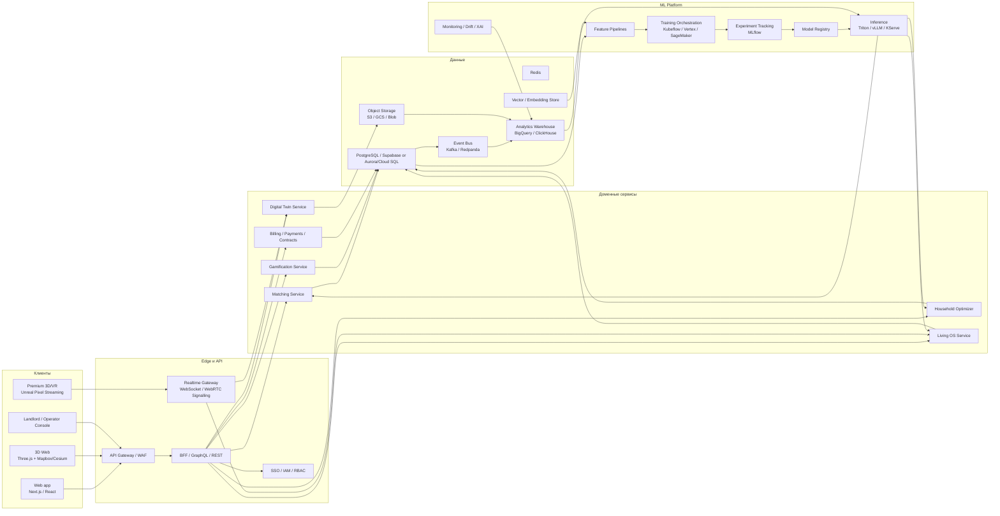
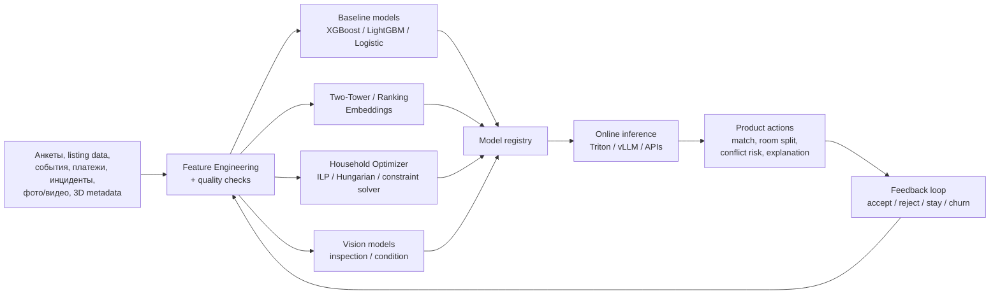
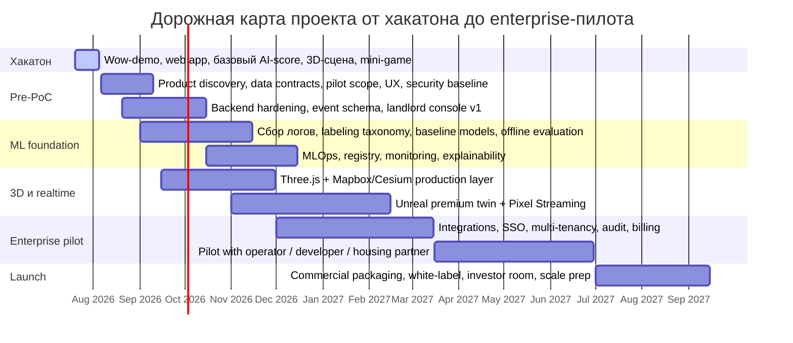
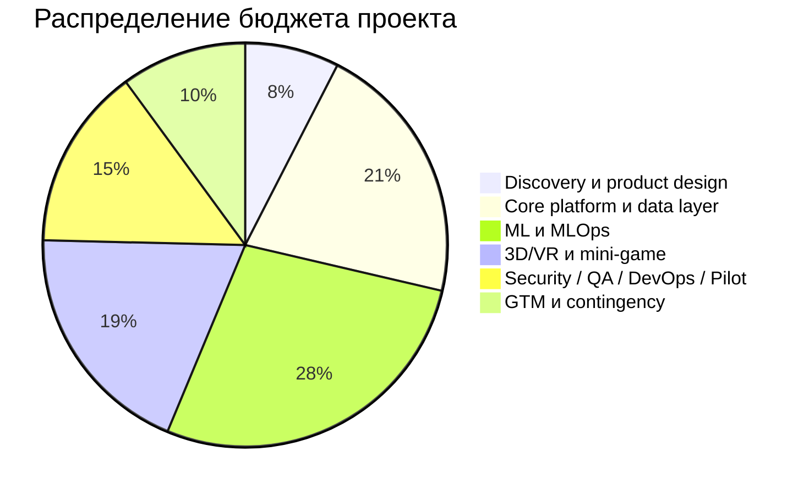

# Миллионный технический проект для хакатона

## Executive summary

Ниже — не “хакатонный пет-проект”, а план **корпоративной платформы уровня enterprise** с бюджетом около **$995 тыс.** на путь от “wow-demo для жюри” до пилота с первыми B2B-клиентами. Я исхожу из двух вещей: из вашего присланного research-брифа с явным требованием сделать investor-ready план с упором на ML, 3D/VR/AR, realtime, безопасность, лицензии и сметы, а также из присланного README, где уже видны зачатки продукта: **Compatibility Engine, Living OS, карта, landlord dashboard, hearts/game-like UI, Next.js + React + Supabase + TypeScript**. fileciteturn0file2 fileciteturn0file1

Самая сильная позиция для такого проекта — не пытаться “впихнуть” весь миллион долларов в хакатон, а показать, что хакатонный прототип — это **тонкий вертикальный срез** большой платформы. В вашем кейсе это особенно логично: локальный контекст уже поддерживает цифровую тему в девелопменте. Ассоциация застройщиков Краснодарского края и Республики Адыгея на своем сайте прямо продвигает идею **“единой цифровой среды проектов / цифровых сервисов и данных”**, а AP-R уже продаёт себя как цифровую платформу с каталогом новостроек, картой, аналитикой и историей цен/сделок. Параллельно региональный Фонд развития инноваций в 2026 году получил федеральное признание за экосистему ИТ-соревнований и продолжает вести “Воронку инновационных стартапов”, то есть после хакатона здесь есть внятная дорога к акселерации и пилоту. citeturn4search4turn1search0turn3view0turn6search0turn6search2turn6search5

Если свести всё к одной формуле, рекомендованное решение выглядит так: **AI-платформа совместной аренды и управляемого co-living с цифровым двойником жилья**, где ML-модели не просто “матчат людей”, а прогнозируют устойчивость состава, риск конфликтов, справедливое распределение комнат/стоимости, а 3D/VR-слой показывает квартиру как интерактивный цифровой объект — в браузере и в “премиум-режиме” через Unreal Pixel Streaming. Именно связка **ML + digital twin + realtime collaboration + gamified onboarding** и даёт ощущение “миллионного” продукта, а не очередного маркетплейса с чатиком. citeturn29search0turn29search3turn28search0turn14search3turn32search0

Практический вывод: **для хакатона** нужно показывать не весь стек, а четыре вещи:  
адаптивный AI-score, живую 3D-сцену квартиры, realtime-коллаборацию и геймифицированный onboarding/mini-game.  
**Для инвестора и техлида** — доказывать, что это расширяется в B2B2C-платформу для застройщиков, управляющих компаний, операторов аренды и вузов/работодателей. Эта стратегия лучше всего бьётся и с вашими материалами, и с местным партнерским ландшафтом. fileciteturn0file1 citeturn4search4turn1search0

## Исходные вводные и сценарии применения

### Что уже видно по вашим материалам

По README у вас уже намечена продуктовая структура: интерфейсы matching, living-os, карта, landlord-кабинет, “emotion/compatibility”-слой и демонстрационные экраны; технологически это web-first стек на **Next.js / React / TypeScript / Supabase**. Это очень хороший фундамент не только для хакатона, но и для enterprise-эволюции: веб уже есть, значит, самый разумный путь — не сносить его ради “чистого Unreal”, а сделать **двухконтурную архитектуру**: web как основной бизнес-интерфейс, Unreal/3D как премиальный визуальный слой и sales/demo engine. fileciteturn0file1 citeturn30search4turn30search1turn32search2

Из research-брифа следует, что несколько параметров ещё **не указаны** явно: целевая отрасль, точный набор датасетов и финальная платформа доставки. Формально это нужно признать. Но по приложенным материалам и локальному девелоперскому контексту самым релевантным доменом остаётся **совместная аренда / co-living / управляемый жилой фонд**. fileciteturn0file2 fileciteturn0file1

### Три релевантных сценария применения

| Сценарий | Для кого | Что продаём | Почему реалистично |
|---|---|---|---|
| **B2C совместная аренда** | студенты, молодые специалисты, релоканты | поиск совместимых соседей, выбор квартиры, правила совместной жизни, split-billing | максимально понятен жюри и пользователям; быстрый wow-эффект |
| **B2B2C для застройщиков и операторов аренды** | застройщики, УК, операторы доходных домов | заселение, room/yield optimization, digital twin объекта, риск-мониторинг, tenant success | лучше всего монетизируется; стыкуется с девелоперской “цифровой средой” |
| **Employer/University housing** | вузы, технопарки, крупные работодатели | подбор соседей, управление местами, контроль конфликтов, аналитика retention | сильный социальный кейс, хороший пилотный рынок |

Рекомендую делать основным именно **второй сценарий**. Он лучше объясняет, зачем тут миллион долларов: застройщик или оператор аренды готов платить не за “приложение знакомств для съёма”, а за **снижение vacancy, снижение конфликтов, более быстрый lease-up, цифровую презентацию фонда и управляемую аналитику по жильцам/объектам**. Эту позицию усиливает и локальный рынок: AP-R уже развивает каталоги, карту, аналитику и публично показывает масштаб цифрового охвата на юге, а региональная Ассоциация прямо работает в повестке данных и цифровых сервисов для стройки. citeturn1search0turn3view0turn4search4

### Почему тема коммерчески не выглядит игрушкой

Публичные данные AP-R показывают, что они уже эксплуатируют цифровую витрину с сотнями ЖК, городским каталогом, картой и “рыночной аналитикой”, а Ассоциация застройщиков Краснодарского края и Республики Адыгея продвигает экосистемный язык “цифровых сервисов и данных”. Это не доказывает, что рынок сам купит именно co-living AI tomorrow, но показывает, что **покупатель цифровой девелоперской платформы в регионе существует как класс**. citeturn1search0turn3view0turn4search4

Если брать макроконтекст, в Краснодаре и ряде крупных городов в 2026 году наблюдалось заметное падение ставок долгосрочной аренды на фоне роста предложения, а значит, у девелопера и оператора аренды появляется стимул повышать конверсию заселения и удержание не только ценой скидки, но и через более точное управление спросом, сегментацией и эксплуатацией жилого продукта. Это как раз окно для ML-модели и цифрового двойника как инструмента продаж и эксплуатации. citeturn33search4turn33search8

## Целевая продуктовая концепция

### Рекомендуемая концепция

Я бы упаковал проект как **Co-Living Twin OS** — платформу, которая объединяет:

1. **AI Matching Core** — подбор совместимых людей, групп и квартир.  
2. **Room Allocation & Yield Engine** — распределение комнат, правил и цены внутри квартиры/объекта.  
3. **Living OS** — управление household-операциями после заселения: задачи, платежи, правила, инциденты, satisfaction.  
4. **3D/VR Digital Twin** — интерактивная квартира/жилой блок/квартал, доступный в браузере и в high-end режиме через Unreal Pixel Streaming.  
5. **Landlord Command Center** — B2B-кабинет для застройщика/оператора.  
6. **Gamified Onboarding** — мини-игра или интерактивный сценарий “сборки идеального household”, который одновременно развлекает, собирает preference-data и повышает доверие к системе.  

Это логично продолжает ваш текущий README, где уже есть Compatibility Engine, Living OS и landlord/dashboard-плоскости. fileciteturn0file1

### Почему такой продукт реально тянет на бюджет порядка $1 млн

У “миллионности” здесь не один источник, а сразу несколько:

| Драйвер стоимости | Что внутри |
|---|---|
| **ML и данные** | события, фичи, обучение, эксперименты, модельный реестр, drift-monitoring, explainability, governance |
| **3D/VR слой** | web-рендер, digital twin pipeline, BIM/CAD ingest, Unreal Pixel Streaming, оптимизация ассетов |
| **Realtime** | presence, ко-браузинг, live-консультации, потоковое управление сценой, событийнaя шина |
| **Enterprise-hardening** | SSO, RBAC/ABAC, аудит, multi-tenancy, журналирование, disaster recovery, pentest |
| **Коммерциализация** | white-label, договоры, лицензирование движков, брендируемые tenant/landlord-порталы |
| **Интеграции** | CRM/ERP, платежи, карты, аналитика, объектные реестры, маркетинговые витрины |

Такой продукт уже ближе не к “приложению”, а к **вертикальной операционной системе для аренды**. Он дорог не потому, что “модный AI”, а потому, что здесь много дорогих контуров одновременно: ML, визуализация, policy/rules, realtime, безопасность и enterprise-интеграции. Это полностью соответствует вашему брифу. fileciteturn0file2

### Базовая архитектурная схема

Эта схема отражает то, что технически оправдано официальной документацией: Kubernetes как production-база, GitHub Actions как CI/CD-уровень, WebSocket/WebRTC для двустороннего realtime, Supabase/Postgres как быстрый старт с RLS, Triton для serving и Kubeflow/MLflow для ML-пайплайнов. Unreal Pixel Streaming официально использует отдельную инфраструктуру Signalling Server / Matchmaker / SFU, а Remote Control API позволяет управлять Unreal по HTTP/WebSocket, что делает его удобным не только для “красивой картинки”, но и для корпоративной оркестрации сцен и демо-режимов. citeturn16search3turn37search0turn15search0turn15search2turn32search6turn17search0turn16search4turn22search3turn29search3turn29search7

## Архитектура платформы и выбор стека

### Выбор 3D/VR/игрового стека

| Вариант | Сильные стороны | Ограничения | Лицензия / стоимость | Где использовать |
|---|---|---|---|---|
| **Unreal Engine** | лучший photoreal, Datasmith metadata, Pixel Streaming, remote control, enterprise-quality demo | тяжёлый пайплайн, дорогой content-production, multi-user editing — beta/use with caution | для ряда неигровых enterprise-use cases у Epic действует Unreal Subscription **$1,850/seat/year**, при этом для игровых продуктов сохраняется royalty-модель после $1M lifetime revenue; юридическую схему надо проверять по EULA под ваш delivery model citeturn13search5turn13search0turn13search6 | flagship demo, sales-suite, premium digital twin |
| **Unity** | быстрее собрать интерактивную сцену, развитый multiplayer stack | для non-gaming apps при финансах/выручке компании свыше **$1M** требуется **Unity Industry**; web-платформа официально не поддерживает mobile; для high-fidelity digital twin часто уступает Unreal citeturn12search0turn12search1turn31search2turn31search3turn30search2 | Pro — **$2,310/seat/year** в 2026; Enterprise/Industry — custom / required by thresholds citeturn12search1turn12search0 | быстрый 3D-клиент, если нужен единый C#-контур |
| **Three.js** | веб-first, лёгкая дистрибуция, open source, легко встроить в Next.js/React | сложнее добиваться AAA-визуала, больше ручной графической инженерии | MIT license citeturn13search3turn13search4 | основной хакатонный web-3D слой |
| **CesiumJS** | лучший web-geospatial, 3D Tiles, глобусы, кварталы, campus-scale digital twin | если нужны managed-data services и готовый глобальный контент, ion быстро превращается в отдельную строку бюджета | CesiumJS — Apache 2.0; Cesium ion: commercial от **$149/mo** individual / **$524/mo** team, premium от **$499/mo** / **$874/mo** citeturn14search3turn14search0 | city-scale / campus-scale twin |
| **Mapbox GL JS** | сильные карты, маршрутизация, геоконтекст, проще для рынков/районов | коммерческий pricing по map loads | web map loads: бесплатно до **50k/month**, затем **$5/1000** в диапазоне 50k–100k load citeturn14search1turn28search0 | карта спроса, районов, доступности, окружения |

Мой вывод простой: **для хакатона и раннего PoC** лучше всего брать **Three.js + Mapbox GL JS** или **Three.js + CesiumJS**. Это даёт лучшую скорость поставки. **Для enterprise-версии** стоит добавить **Unreal** как high-end контур через Pixel Streaming, особенно если ставка делается на “вау-демо” для застройщика, инвестора или оператора фонда. citeturn13search3turn28search0turn14search3turn29search0turn29search3

### Выбор облака

| Облако | Плюсы | Минусы | Публичные ориентиры по GPU |
|---|---|---|---|
| **AWS** | сильный enterprise-market fit, хорошие варианты для Unreal / streaming / GPU, mature ecosystem | публичные цены не всегда удобно сравнивать без калькулятора/региона, GPU-ёмкость скачет | EC2 Capacity Blocks: **p5.4xlarge (1×H100)** от **$4.326/hr** в us-east; **p5.48xlarge (8×H100)** в примере — **$31.464/hr**; AWS также официально заявила снижение цен на P5/P5en/P4d/P4de в 2025 citeturn21search1turn21search3turn19search0 |
| **GCP** | очень прозрачные публичные GPU-прайсы, сильный ML стек, понятный путь через Vertex AI | для VR/Unreal-heavy сценария обычно менее “нативный” выбор, чем AWS | **A3 High (8×H100)** — около **$88.49/hr** on-demand; **A3 Mega (8×H100)** — около **$93.40/hr**; доступны также G2/L4 и G4/RTX PRO 6000 классы citeturn18search0turn18search1 |
| **Azure** | отлично ложится в Microsoft-экосистемы и enterprise procurement | публичная прозрачность цен по GPU-VM хуже; часто нужен quote | серия **NCads H100 v5** — до **2× NVIDIA H100 NVL** по **94 GB** каждая и до **640 GiB** RAM; бюджетирование обычно лучше закладывать по коммерческому офферу/резервированию citeturn20search3 |

Рекомендация такая: если ваш pitch строится вокруг **Unreal / Pixel Streaming / digital twin demo**, выбирайте **AWS как primary cloud**. Если в центре тяжести **ML-training economics и managed AI workflows**, GCP очень силён. Но для хакатона и даже пилота не надо раздувать multi-cloud: это красиво для архитектурной легенды, но очень быстро превращается в налог на сложность. Для “миллионного проекта” допустим **AWS primary + GCP burst only for training**; для первых 6 месяцев я бы всё равно держал **single-cloud**. citeturn29search0turn29search3turn18search0turn19search0

### Рекомендуемый server/data stack

| Контур | Рекомендация | Зачем |
|---|---|---|
| Web/BFF | Next.js + React + TypeScript + Node/Nest or FastAPI | у вас уже есть web-first фундамент; быстрое масштабирование UI и API слоя fileciteturn0file1 |
| Auth | WorkOS / Keycloak / Entra ID + OIDC/SAML | enterprise SSO и B2B-tenanting |
| OLTP | PostgreSQL; на старте можно оставить Supabase, потом перейти на Aurora/Cloud SQL/AlloyDB | Supabase даёт быстрый старт, RLS и storage; enterprise может потребовать более жёсткий контроль окружения citeturn32search2turn32search6turn32search4 |
| Cache/queue | Redis | latency, sessions, ephemeral state |
| Events | Kafka / Redpanda | activity stream, analytics, ML features |
| Object storage | S3/GCS/Blob | медиа, 3D-assets, training artifacts, inspections |
| Search | OpenSearch / Meilisearch | поиск объектов и кандидатов |
| Analytics | BigQuery / ClickHouse | event-аналитика, cohort, model monitoring |
| Realtime | WebSocket + WebRTC | state sync, presence, calls, pixel streaming, co-browsing citeturn15search0turn15search2turn32search0 |
| Orchestration | Kubernetes | production-ready orchestration, HA, RBAC, autoscaling citeturn16search3 |
| CI/CD | GitHub Actions + GitOps controller | reproducible deliveries, environments, approvals citeturn37search0turn37search5 |
| Observability | OpenTelemetry + Prometheus/Grafana/Loki | traces + metrics + logs, end-to-end debugging citeturn16search5 |

Главное архитектурное решение здесь такое: **не строить всё вокруг Supabase навсегда**, но использовать его как **ускоритель прототипа и PoC**. Для хакатона и первых недель это идеально. Для enterprise-пилота — сделать миграционный путь к “controlled Postgres + object storage + event bus + k8s”. Это честно и технологически, и перед инвестором. citeturn32search2turn32search6turn16search3

## Детальный ML-план и MLOps

### Какой ML вообще нужен в этом продукте

Здесь не одна модель, а **семейство моделей и оптимизаторов**:

| Контур | Что считает | Тип модели |
|---|---|---|
| **Person–Person Compatibility** | насколько два человека совместимы как соседи | baseline: gradient boosting / later deep pairwise ranker |
| **Person–Room Fit** | какая комната/квартира подходит человеку | ranking / recommender |
| **Household Stability** | вероятность early churn, конфликта, просрочек, плохого удержания | binary / survival / time-series |
| **Room Pricing Optimizer** | как справедливо поделить стоимость комнат внутри одного household | optimization / constrained solver |
| **Vision Inspection** | признаки состояния квартиры по фото/видео | CV detection/segmentation |
| **Copilot / Explanation Layer** | почему система предложила такой матч и какие есть trade-offs | LLM + templated explanation + policy layer |

Самая частая ошибка подобных проектов — пытаться в первый же месяц делать “магическую нейросеть, которая выбирает людей”. Я рекомендую наоборот:  
сначала жёсткие правила и табличный ML,  
потом ranking/embedding,  
только потом multimodal stack.  

Так вы быстрее доходите до пилота и лучше контролируете доверие к системе. Под это нормально ложатся и официальные инструменты PyTorch для distributed training, и MLflow/Kubeflow для production-цикла, и Triton/vLLM для serving. citeturn34search0turn34search4turn22search3turn16search4turn17search0turn22search2

### Рекомендуемая модельная эволюция

Эта эволюция хорошо объяснима техлиду и инвестору: сначала **predictive operations**, потом **optimization**, потом **multimodal intelligence**. С инженерной стороны масштабирование моделей можно вести через `torch.distributed`, `DistributedDataParallel` и при необходимости `FullyShardedDataParallel`, а inference удобно строить через Triton с REST/gRPC и dynamic batching. Для open-model serving LLM-контур хорошо стыкуется с vLLM, который официально поддерживает OpenAI-compatible server mode. citeturn34search0turn34search3turn34search4turn17search0turn22search2turn22search5

### Данные, сбор и аннотация

Под продуктивную версию нужно заранее закладывать **versioned data contracts**. Минимальный набор источников:

| Источник | Примеры полей | Что важно |
|---|---|---|
| Профили и анкеты | бюджет, режим дня, pets, smoking, noise tolerance, gender preference if legally allowed, work/study mode | отделять обязательные и чувствительные поля |
| Объекты и комнаты | цена, гео, размер, освещённость, наличие мебели, proximity, house rules | нормализовать в единый schema |
| Поведенческие события | просмотры, отклики, лайки, отказ, повторный просмотр, длительность 3D-тура | нужны event IDs и timestamps |
| Операционные события | просрочки, жалобы, задачи, уборка, split payments, disputes | это золото для churn/conflict prediction |
| Визуальные данные | фото, видео, 3D-сцены, metadata из BIM/CAD | отдельный media-pipeline |
| Экспертная разметка | тип конфликта, серьёзность, причина съезда, состояние помещения | нужна чёткая taxonomy |

Для стартовой разметки я бы делал не “толпы аннотаторов”, а **операционную таксономию** из 20–40 категорий: финансовые инциденты, бытовые конфликты, mismatch по режиму, нарушение house rules, проблемы с объектом, и так далее. Это даст supervised-targets, которые реально помогают бизнесу. Визуальный контур разумно аннотировать только для приёмки/эксплуатации: дефекты, загрязнение, повреждения, мебель, occupancy signals. Для 3D/BIM-данных в Unreal важна поддержка metadata из Datasmith: это позволяет связывать сцену не только с mesh, но и с бизнес-сущностями, например room_id, price_zone, material class, equipment type. citeturn29search5turn29search8

### Preprocessing и feature engineering

Для этого проекта preprocessing — это половина успеха. Я рекомендую следующие технические правила:

| Блок | Практика |
|---|---|
| PII-separation | личные данные и feature-store должны жить раздельно |
| Time windows | все behavioural features считать по окнам 1/7/30/90 дней |
| Missingness | “нет ответа” — отдельный informative feature, а не просто null |
| Calibration | scores должны быть откалиброваны, а не только “точны” |
| Cold start | при нулевой истории переходить в rules + content-based mode |
| Label leakage | не пускать post-lease признаки в pre-lease модели |
| Fairness review | чувствительные признаки нельзя напрямую превращать в скрытую дискриминацию |

С точки зрения governance это уже попадает в best practice NIST AI RMF: governance, mapping risks, measurement and management. Для РФ-пилота отдельно критичен контур персональных и биометрических данных: базовый 152-ФЗ и его актуальная редакция продолжают прямо регулировать такие категории. Если проект будет выходить в ЕС, нужно учитывать и AI Act как отдельный регуляторный слой поверх privacy/regulatory governance. citeturn24search5turn24search3turn26search9turn27search0

### Валидация и KPI модели

Я бы делил метрики на три слоя.

| Слой | Метрики |
|---|---|
| Offline ML | AUC-ROC, PR-AUC, NDCG@k, calibration error, MAE по room split, top-k hit rate |
| Product metrics | accept rate, lease conversion, no-show reduction, time-to-match, tour completion |
| Business metrics | vacancy reduction, retention, conflict incidence per household, on-time payment rate, operator workload |

Ключевая мысль для инвестора: модель считается хорошей **не когда AUC красивый**, а когда падают конфликты и быстрее закрываются unit-ы. Поэтому production-loop должен хранить ground truth строго по жизненному циклу сделки и проживания. Tracking экспериментов стоит держать в MLflow, а execution — в Kubeflow pipelines или managed equivalent. citeturn22search3turn16search4

### Explainability

Здесь я бы не делал ставку на “чёрный ящик”. Для B2B-клиента и конечного пользователя нужно три уровня объяснений:

| Уровень | Что показываем |
|---|---|
| User-facing | “почему эта квартира/группа вам подошла” в человеческом языке |
| Operator-facing | feature contribution, key blockers, what-if analysis |
| Audit-facing | model version, thresholds, dataset lineage, bias/fairness checks |

Практически это можно реализовать двумя способами:

- open-source стек: SHAP + собственный explanation-service + MLflow artifacts;
- managed вариант: Vertex Explainable AI.

AWS Clarify исторически решал часть задач explainability, но есть важная **свежая** деталь: AWS прямо пишет, что **новый доступ для новых клиентов закрывается с 2026-07-30**, а сервис остаётся без планов на новые функции. Поэтому стартовать новый enterprise-контур на Clarify я бы уже не советовал; лучше либо open-source-first, либо Vertex Explainable AI, если нужен managed XAI-контур. citeturn35search0turn35search2turn36search1

### MLOps, CI/CD и мониторинг

| Контур | Рекомендация |
|---|---|
| Training orchestration | Kubeflow Pipelines или managed orchestration |
| Experiment tracking | MLflow |
| Registry | MLflow Registry / managed registry |
| Serving | Triton для ML/CV; vLLM для LLM |
| CI/CD | GitHub Actions + environment approvals + immutable artifacts |
| Telemetry | OpenTelemetry traces/metrics/logs |
| Drift | input drift, feature drift, output distribution, calibration drift |
| Runtime | latency p50/p95/p99, throughput, GPU utilization, cost per inference |
| Rollback | shadow mode, canary, blue/green |

Kubernetes production guidance официально подчёркивает требования к HA, user management, certificates, resource limits и service accounts; GitHub Actions даёт достаточно зрелый CI/CD-контур с workflow YAML, secrets и environments; OpenTelemetry покрывает traces, metrics и logs, что особенно важно, когда у вас в одной транзакции участвуют web app, matching API, realtime gateway и model-serving. citeturn16search3turn37search5turn37search6turn16search5

### Требования к GPU и compute

| Задача | Рекомендованный класс железа | Комментарий |
|---|---|---|
| Tabular baseline training | CPU / L4-class / modest GPU | дешёвый этап, не нужен H100 |
| Two-tower embeddings | 1–2× L40S или 1× H100 | зависит от объёма batch и эмбеддингов |
| Multimodal fine-tune | 4–8× H100 | основной дорогой этап |
| LLM inference 7B–14B | 1× H100 NVL или 2× L40S | если нужен low-latency reasoning/shared explanations |
| Pixel Streaming / premium 3D | L40S / RTX-class / G6-family | больше про render + encode, чем про training |

Почему именно такие классы: H100 официально даёт 80 GB HBM3 в варианте SXM и до 94 GB в NVL, а также очень высокую память и tensor throughput; L40S имеет 48 GB GDDR6, RT/Tensor cores и выглядит особенно разумным компромиссом для графики + inference/render задач. По публичным прайсам ориентирами могут служить, например, **AWS p5.4xlarge** с **1×H100** от **$4.326/hr** через Capacity Blocks и **GCP A3 High** с **8×H100** около **$88.49/hr** on-demand. Эти цифры нельзя сравнивать как абсолютную истину “один к одному” из-за разных pricing models, но как порядок бюджета они полезны. citeturn23search0turn23search5turn21search1turn18search0

## 3D/VR/AR, realtime и mini-game

### Как интегрировать 3D без технического самоубийства

На практике нужен **двухуровневый 3D-контур**:

| Уровень | Технология | Роль |
|---|---|---|
| **Основной** | Three.js + Mapbox GL JS / CesiumJS | хакатон, web distribution, быстрый продукт |
| **Премиальный** | Unreal Engine + Pixel Streaming | шоукейс, переговоры, продажи, flagship deployments |

Это лучший компромисс между скоростью доставки и “вау-фактором”. Three.js спокойно живёт рядом с React/Next.js, а Mapbox GL JS и CesiumJS дают геопривязку, квартал/район, слои транспортной доступности и окружения. Для Unreal же официальные Pixel Streaming docs дают готовую модель доставки в браузер через Signalling Server, Matchmaker и SFU, а Datasmith metadata хорошо решает связку BIM/CAD → runtime. citeturn13search4turn28search0turn14search3turn29search0turn29search3turn29search5

### Realtime-слой

Realtime здесь нужен не “для галочки”, а в четырёх конкретных сценариях:

| Сценарий | Транспорт |
|---|---|
| live-обновление household state, events, likes, presence | WebSocket |
| co-browsing и совместный тур по сцене | WebSocket + WebRTC data/media |
| видеоконсультация агента / менеджера / оператора | WebRTC |
| Unreal Pixel Streaming | WebRTC family + signalling infra |

WebSocket — стандартизованный двухсторонний TCP-based протокол с HTTP Upgrade handshake, а WebRTC официально используется для peer-to-peer media/data scenarios. Для продукта это означает: **состояние и presence** держим через WebSocket/Broadcast/Presence; **видео, low-latency media и pixel streaming** — через WebRTC. Если на раннем этапе вы хотите минимизировать ops-боль, Supabase Realtime даёт broadcast/presence/postgres changes из коробки и вполне подходит для прототипа и части PoC-нагрузки. citeturn15search0turn15search2turn32search0turn32search1

### Что показывать в 3D

Я бы делил 3D-функции на три группы.

| Группа | Что именно |
|---|---|
| **View** | интерактивная квартира, переключение комнат, предметы, дневной/вечерний сценарий, слои района |
| **Decision** | heatmap совместимости, room-price split, “что если” для состава household |
| **Operations** | инциденты по комнате, задача на осмотр, digital check-in / check-out, изменение конфигурации |

Самая сильная investor/demo-фича — это не просто “полетать по квартире”, а **видеть ML-решение прямо внутри цифрового двойника**:  
кто в какую комнату садится,  
почему,  
какой будет split стоимости,  
где риски конфликта,  
что меняется, если заменить одного участника или изменить budget cap.  

Тогда 3D становится не витриной, а **интерфейсом принятия решения**.

### Mini-game и геймификация

Рекомендую mini-game типа **“Собери устойчивый household”**. Сценарий такой:

1. Пользователь или команда выбирает 3–5 персонажей с разными предпочтениями.  
2. Видит 3D-квартиру.  
3. Должен распределить людей по комнатам, правилам и бюджету.  
4. AI сравнивает “человеческую” конфигурацию с оптимальной.  
5. Итог — score household, риск конфликта, справедливость split, вероятность удержания.

Что это даёт:

- зрелищный демо-формат для хакатона;
- объяснимый bridge между “игрой” и серьёзной ML-моделью;
- сбор preference-data и поведенческих паттернов;
- вирусный social layer.

По сути, mini-game — это не игрушка, а **data collection funnel** и onboarding step.

## Дорожная карта, бюджет и KPI

### Дорожная карта

Такая дорожная карта реалистична, потому что отделяет **хакатонный slice** от **дорогих enterprise-контуров**. Это важно: пытаться сделать “миллионный продукт” прямо на хакатоне — почти гарантированный провал. Показывать же осмысленный вертикальный срез и заранее продуманную фазовую эволюцию — как раз то, что хорошо читается инвестором и зрелым техлидом. fileciteturn0file2

### Бюджет по этапам

| Этап | Человеко-часы | Стоимость людей | Infra / лицензии / подрядчики | Итого |
|---|---:|---:|---:|---:|
| Discovery, product design, domain/data contracts | 900 | $67,500 | $7,500 | **$75,000** |
| Core backend, web platform, event/data layer | 2,400 | $192,000 | $18,000 | **$210,000** |
| ML, data engineering, labeling, MLOps | 2,600 | $221,000 | $54,000 | **$275,000** |
| 3D/VR, digital twin, mini-game, Unreal premium layer | 1,800 | $153,000 | $37,000 | **$190,000** |
| Security, QA, DevOps, compliance, pilot launch | 1,300 | $104,000 | $41,000 | **$145,000** |
| GTM integration, packaging, contingency reserve | 700 | $59,500 | $40,500 | **$100,000** |
| **Всего** | **9,700** | **$797,000** | **$198,000** | **$995,000** |

Эта смета реалистична для сложного вертикального B2B2C-продукта: основная статья — команда, потом ML/infra/labeling и 3D/content/engine-related расходы. Лицензионные и инфраструктурные расходы отдельно оправдываются официальными ценами и требованиями по Unreal, Unity, Cesium ion, Mapbox, GPU compute и managed cloud services. citeturn13search5turn12search1turn14search0turn14search1turn21search1turn18search0

### Бюджет команды по ролям

| Роль | FTE / длительность | Оценка |
|---|---|---:|
| Staff/Lead Architect | 0.5–1.0 FTE × 12 мес | $90k–$140k |
| Product Manager / Founder’s Office | 0.5–1.0 FTE × 12 мес | $45k–$95k |
| Backend engineers | 2–3 FTE × 8–12 мес | $160k–$260k |
| Frontend / 3D web engineers | 1.5–2 FTE × 8–10 мес | $95k–$165k |
| ML engineers / data scientists | 2 FTE × 8–10 мес | $150k–$240k |
| MLOps / DevOps / SRE | 1 FTE × 8–10 мес | $75k–$130k |
| Unreal / technical artist / TD | 1–2 FTE × 6–8 мес | $70k–$170k |
| QA / security / pentest / legal contractors | по фазам | $50k–$120k |

Это и есть причина, по которой проект легко уходит к планке около $1M: не из-за “дорогой кнопки AI”, а из-за комбинации senior engineering, 3D content, MLOps и enterprise-hardening.

### KPI и метрики успеха

| Направление | KPI на пилот |
|---|---|
| Matching | +20–30% к accept rate предложений против rule-only baseline |
| Leasing funnel | -30–50% time-to-match / time-to-fill |
| Retention | -15–25% ранних съездов в pilot cohort |
| Household quality | -20% конфликтных инцидентов на household |
| Revenue / yield | +3–7% к среднему эффективному доходу на unit/room за счёт split optimization |
| Ops efficiency | -25–40% ручной нагрузки оператора на подбор и сопровождение |
| 3D engagement | 60%+ completion rate интерактивного тура, 4+ мин median session |
| ML operations | p95 inference < 300 ms для tabular/ranking; < 2 s для explanation layer |
| Reliability | 99.5%+ uptime для pilot-stage core services |

Эти KPI — не “рыночные обещания”, а рекомендуемая система измерений для пилота. На защите важно прямо сказать, что baseline будет собран в пилотной фазе, а значение успеха оценивается относительно rule-only и manual-ops сценариев.

## Риски, безопасность, лицензии, IP и упрощённые варианты

### Основные риски и как их гасить

| Риск | Почему опасно | Что делать |
|---|---|---|
| **Scope explosion** | хакатон утонет в enterprise-фантазиях | жёстко разделить hackathon slice и 12-месячный roadmap |
| **Недоверие к AI matching** | пользователи и B2B-клиенты не поверят “чёрному ящику” | rules-first, explainability, operator override, audit trail |
| **Bias / fairness** | репутационные и регуляторные риски | NIST AI RMF governance, fairness review, ограничение чувствительных признаков |
| **Privacy / personal data** | 152-ФЗ, биометрия, consent, data localization | PII-separation, consent registry, encryption, minimization |
| **GPU / cloud cost volatility** | обучение и premium 3D могут “съесть” бюджет | train burst windows, reserved capacity, L40S where possible |
| **3D content bottleneck** | красивый twin без пайплайна быстро станет ручным адом | glTF/3D Tiles pipeline, asset standards, Datasmith ingest |
| **Licensing ambiguity** | Unreal/Unity use case можно оформить неверно | early legal review against exact delivery model/EULA |
| **Realtime fragility** | co-browsing/pixel streaming плохо работают под нагрузкой | отдельный perf budget, synthetic monitoring, SFU stress tests |

С точки зрения security baseline я бы закладывал минимум: WAF, tenant isolation, audit logs, secrets management, SSO, MFA для B2B, mTLS внутри service mesh при росте, резервное копирование, объектный lifecycle policy, signed URLs, RLS/ABAC на уровне данных и независимый pentest перед пилотом. Для веб- и API-слоя хороший минимальный reference — OWASP ASVS 5.0, а для GenAI/LLM-контуров — OWASP GenAI Security Project. citeturn25search5turn25search0turn25search4

### Безопасность и соответствие

С точки зрения governance я бы опирался на такую матрицу:

| Контур | База |
|---|---|
| Web/API security | OWASP ASVS 5.0 |
| AI governance | NIST AI RMF |
| Персональные данные в РФ | 152-ФЗ и актуальные поправки |
| EU expansion | EU AI Act + privacy compliance stack |
| Tenant/enterprise access | SSO, RBAC/ABAC, audit, environment isolation |
| Data plane | encryption at rest/in transit, data minimization, retention policy |

NIST AI RMF прямо позиционирует trustworthiness, security, reliability, accountability, transparency и privacy-enhancement как столпы зрелой AI-системы. Для совместной аренды это особенно важно, потому что здесь легко скатиться в дискриминационные или непрозрачные решения. Поэтому policy engine и operator override должны быть не “дополнением”, а обязательным контуром. citeturn24search5turn24search6turn26search9turn27search0

### IP, лицензирование и коммерциализация

| Актив | Как защищать / монетизировать |
|---|---|
| Модель совместимости и удержания | trade secret + model registry + договоры + ограниченный API access |
| Feature store и event taxonomy | внутренний know-how; не раскрывать как commodity |
| 3D pipeline, room split optimizer, household simulator | патентопригодность спорная, но IP как software process и proprietary tooling — да |
| Бренд и white-label package | отдельный B2B license / annual platform fee |
| Customer data moat | договорно закреплённая ownership model и derived insights policy |

По лицензиям картина такая:  
Three.js — максимально безопасный open-source выбор (MIT), CesiumJS — Apache 2.0, Supabase даёт open stack + hosted mode, Mapbox — коммерческий metered pricing, Unreal и Unity требуют очень аккуратной квалификации use case и revenue thresholds. Из этого следует практический вывод: **open-source-first web слой + selectively commercial 3D/geo services** — самый здоровый баланс риска и стоимости. citeturn13search3turn14search3turn32search2turn14search1turn13search5turn12search0

### Упрощённые варианты

| Вариант | Срок | Бюджет | Что внутри |
|---|---:|---:|---|
| **Hackathon MVP** | 48–72 часа | **$15k–$35k** internal opportunity cost | анкета, rule-based + лёгкий ML-score, один 3D-тур, карта, mini-game, basic landlord view |
| **Investor-friendly PoC** | 8–10 недель | **$120k–$180k** | web app, Supabase/Postgres, baseline ML, Three.js/Mapbox, basic realtime, demo analytics |
| **Enterprise pilot** | 4–6 месяцев | **$350k–$500k** | multi-tenant backend, MLOps, explainability, digital twin pipeline, security baseline, pilot integrations |
| **Full-scale million-dollar platform** | 10–14 месяцев | **$850k–$1.1M** | всё выше + Unreal premium layer, deeper MLOps, advanced optimization, white-label, compliance hardening |

Если говорить честно и по делу, **для победы на хакатоне** лучшая стратегия — делать **не “полный million-dollar stack”, а его очень убедительный, дорогой на вид, но узкий срез**. В вашем случае этот срез должен быть таким:

- AI-подбор + объяснение;  
- 3D-квартира с интерактивным распределением комнат;  
- realtime/presence;  
- мини-игра как data funnel;  
- landlord/operator dashboard с метриками.

Это выглядит как большой корпоративный продукт уже сейчас, но не убивает команду избыточным объёмом.

### Финальная рекомендация

Если бы я собирал это как техлид под защиту, я бы заявил проект так:

> **Enterprise AI Co-Living Twin Platform** — система для застройщиков, операторов аренды и managed-living площадок, которая с помощью ML, digital twin и realtime orchestration повышает конверсию заселения, снижает конфликты и превращает совместную аренду из хаотичного процесса в управляемый цифровой продукт.

Технически я бы шёл по такой лестнице:

1. **Хакатон:** Next.js + Supabase + Three.js + Mapbox, baseline matching, mini-game.  
2. **PoC:** event schema, offline ML, landlord console, 3D room allocation.  
3. **Pilot:** Kubernetes, MLflow/Kubeflow, Triton, production monitoring, SSO, security baseline.  
4. **Premium enterprise:** Unreal Pixel Streaming, digital twin operations, advanced optimization, white-label.

Именно такая композиция выглядит достаточно сложной, дорогой и корпоративной, чтобы обоснованно стоить **около одного миллиона долларов**, но при этом остаётся не фантазией, а реализуемым планом.